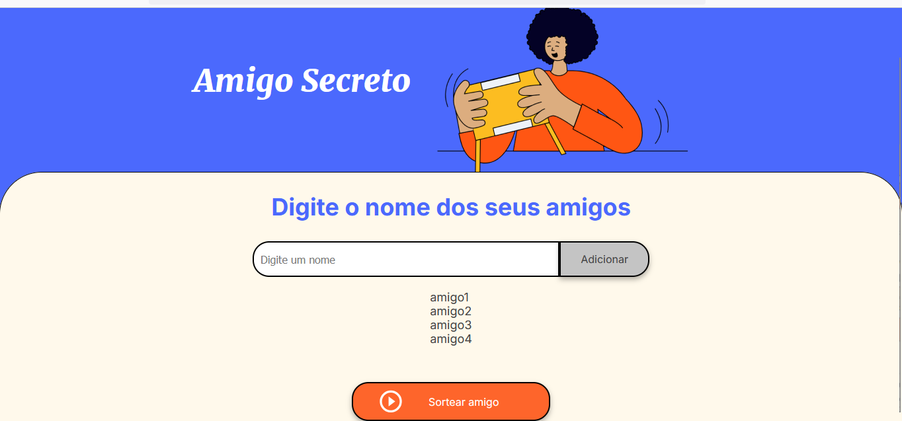
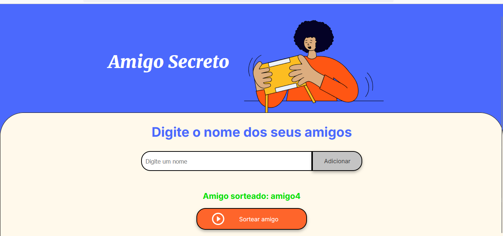

 <h1> Amigo Secreto 🎁 </h1>

  <h2>📑 Índice</h2>
  <li>Descrição do Projeto</li>
  <li>Tecnologias Utilizadas</li>
  <li>Status do Projeto</li>
  <li> Acesso ao Projeto</li>
  <li>Funcionalidades e Demonstração da Aplicação</li>
  <li>Pessoas Contribuidoras</li>
    <li>Licença</li>
   
  <li>Funcionalidades e Demonstração da Aplicação</li>

 ## 📖 Descrição do Projeto

Desafio do cursos de lógica de programação da Alura.
Um projeto para sortear um Amigo  de forma simples e eficiente.

##    Tecnologias

  
  
  

  

## Status do Projeto
<h4>concluído</h4>

  

##  Acesso ao Projeto

1. git clone https://github.com/samuelAguiar04/Desafio-do-numero-secreto.git

2. - cd (nome do arquivo)
     
 3.  - acessar o arquivo index.html no navegador
       

## Funcionalidades e Demonstração da Aplicação

Adicionar amigos

Realizar sorteio 

Exibir resultado

Interface intuitiva e fácil de usar

(Adicione aqui prints do projeto rodando ou um link para um vídeo demonstrativo.)

  

    <strong>Essa é a tela inicial do jogo: </strong>
    
  
    

 <strong>Inserimos os nomes dos participantes: </strong>

  
    
 

   

 

 <strong>Aqui o amigo secreto é sorteado e vemos o resultado:<strong>
  
    
  

## 👨‍💻 Pessoas Desenvolvedoras do Projeto

- [Alura](https://github.com/usuario1)
- [SamuelAguiar04](https://github.com/usuario2)

## 👥 Pessoas Contribuidoras

- [Alura](https://github.com/usuario1)
- [SamuelAguiar04](https://github.com/usuario2)

## 📜 Licença

Este projeto está sob a licença MIT. Sinta-se à vontade para utilizá-lo e modificá-lo! 🎉
